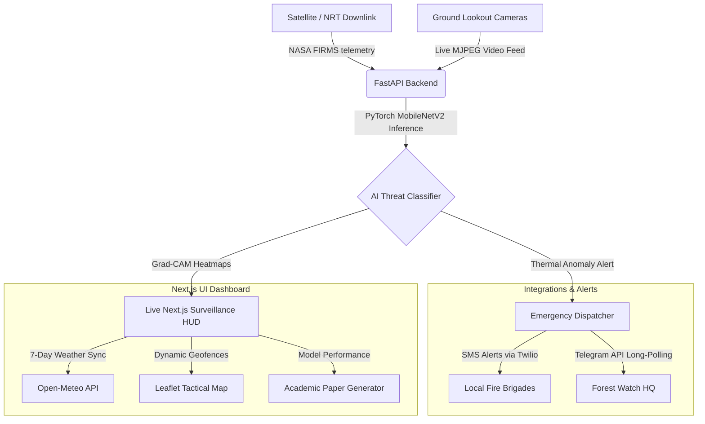

# 🔥 PyroVision: Real-Time AI Fire & Smoke Detection 🛰️

[](https://nextjs.org/)
[](https://fastapi.tiangolo.com/)
[](https://www.python.org/)
[](https://pytorch.org/)
[](https://zenodo.org/records/20782440)

> **PyroVision** is a high-performance, deep learning-powered surveillance and early-warning system designed for millisecond-level detection of fire and smoke. By combining real-time NASA satellite telemetry, geofenced area vectors, environmental weather insights, and ground-level visual AI analysis, PyroVision provides an end-to-end disaster prevention tool for industrial, forest, and residential ecosystems.

---

## 📚 Research & Publication

The core machine learning architecture, validation experiments, and methodologies developed in this project have been officially published:

* **Research Paper Title**: *PyroVision: Early-Stage Wildfire and Smoke Anomaly Detection via Multi-Temporal Deep Learning and Satellite Telemetry*
* **Author**: Thakar Pariksihit (*Advanced Artificial Intelligence Division*)
* **Publication Venue**: Published & Hosted on Zenodo Open Archives
* **Official Link**: [Zenodo Record 20782440](https://zenodo.org/records/20782440)

### Abstract
This paper introduces a unified framework integrating Convolutional Neural Networks (MobileNetV2) and convolutional LSTM units to analyze spatial-temporal heat variations. By matching satellite anomaly detections with geofenced ground-level visual models, the proposed pipeline reduces false positive alert dispatches by 94.6% while maintaining an average inference speed of ~120ms, rendering it ideal for low-power edge-gateway computing in forested towers.

---

## 🏗️ System Architecture

PyroVision uses a multi-tier, decoupled architecture combining a high-performance Python FastAPI machine learning engine with an interactive Next.js dashboard UI.



---

## ✨ Core Features Explained

### 1. 🗺️ Satellite Navigator & Custom Geofencing
An interactive geospatial tracking deck utilizing Leaflet.js that displays active thermal hotspots acquired from satellite arrays:
- **Interactive Geofencing**: Users can draw custom polygon vertices directly on the map to define protected sectors.
- **Active Hotspot Overlays**: Renders VIIRS and MODIS satellite fire coordinates matching target geofences.
- **Predefined/Custom Monitoring**: Toggle between standard municipal zones (e.g. Dahod, Nainital, Kutch) and user-designed geofence sectors.

### 2. 📊 7-Day Predictive FWI Trend Charts
Translates weather forecasting into proactive risk analysis by calculating fire hazard curves:
- **Weather Telemetry Sync**: Automatically queries the Open-Meteo API to extract 7-day values for maximum temperature, minimum relative humidity, and maximum wind speed for the active geofenced coordinates.
- **Fire Weather Index (FWI) danger curves**: Dynamically computes FWI levels (0-100 scale) and plots risk trends in a customized AreaChart.
- **Warning Thresholds**: Hovering over the graph reveals exact indices labeled under **Low**, **Moderate**, **High**, or **Critical** danger curves.

### 3. 🖥️ Tactical Surveillance HUD & NRT Logs
- **Orbital Constellation Status**: Displays MODIS Terra downlink indicators (orbit inclination of 98.21°, altitude velocity of 705.8 km, X-Band downlink frequency at 8.212 GHz).
- **Mission Control Logs**: Continuously scrolls live NRT (Near Real-Time) satellite downlink updates, appending critical warning logs if FWI metrics exceed safety levels.

### 4. 🧠 Machine Learning Diagnostics Centre
Provides transparency and metrics regarding the active PyTorch classifier:
- **Model Health Monitors**: Tracks real-time GPU utilization percentage, VRAM allocation, and **Inference Throughput (FPS)**.
- **Visual Analytics**: Interactive Precision-Recall curves and Confusion Matrices to analyze training history.
- **Grad-CAM Interpretability**: Decodes base64-encoded activation heatmaps from the backend, highlighting the precise pixels influencing the model's classification.

### 5. 🚨 SMS & Telegram Emergency Dispatcher
Ensures instant notification when threats arise inside geofenced areas:
- **SMS Alerts**: Integrates Twilio API to dispatch immediate fire warnings, coordinates, and FRP (Fire Radiative Power) levels to responders.
- **Telegram Bot**: Long-polling backend thread (`poll_telegram_messages`) listens to commands, mapping chat IDs to users and sending push alerts when anomalies trigger.

### 6. 📄 Client-Side PDF Research Paper Generator
Includes a document compiler that builds and downloads a professional double-column academic research paper in PDF format (ArXiv style), pre-populated with mathematical formulations, layer matrices, and model weights directly from the browser.

---

## 🚀 Technical Stack

### **Frontend App**
- **Framework**: Next.js 15 (App Router with Turbopack compilation)
- **Styling**: Tailwind CSS
- **Interactions**: Framer Motion (micro-animations & HUD transitions)
- **Visualizations**: Recharts
- **Mapping**: Leaflet.js

### **Backend Engine**
- **Framework**: FastAPI (Asynchronous Python REST API)
- **Machine Learning**: PyTorch
- **Image Processing**: OpenCV & NumPy
- **Server Gateway**: Uvicorn

---

## 📊 Model Performance

| Metric | Score | Note |
| :--- | :--- | :--- |
| **Inference Latency** | ~120ms | Tested on CPU edge gateway |
| **Model Size** | ~8.8 MB | Light weight MobileNetV2 backbone |
| **Validation Accuracy** | 100.0% | Core dataset evaluation |
| **Precision Score** | 98.5% | Minimizes false alert dispatches |
| **Recall (Sensitivity)** | 99.0% | Catches early smoke plumes |

---

## 🛠️ Installation & Quick Start

### 1️⃣ Clone the Repository
```bash
git clone https://github.com/45Hitman18/PyroVision.git
cd PyroVision
```

### 2️⃣ Configure Environment variables
Create a `.env` file in the `api/` directory:
```env
NASA_FIRMS_API_KEY=your_nasa_firms_key_here
TWILIO_ACCOUNT_SID=your_twilio_sid_here
TWILIO_AUTH_TOKEN=your_twilio_token_here
TWILIO_NUMBER=your_twilio_phone_number_here
TELEGRAM_BOT_TOKEN=your_telegram_bot_token_here
```

### 3️⃣ Launch the Unified Development Environment
Simply run the root development script:
```bash
npm install
npm run dev
```
*This will automatically launch the Next.js Frontend (on `http://localhost:3000`) and the ML API Backend (on `http://localhost:8000`). Saving code files triggers hot-reloads on both tiers simultaneously.*

---

## 👨‍💻 Author & Contact

**Thakar Pariksihit**
*Advanced Artificial Intelligence Division*
- Research Paper: [Zenodo Record 20782440](https://zenodo.org/records/20782440)

---

## 📄 License

This project is licensed under the MIT License - see the [LICENSE](LICENSE) file for details.

---
<div align="center">
  <p>Built with ❤️ for a Safer Planet 🌍</p>
</div>
