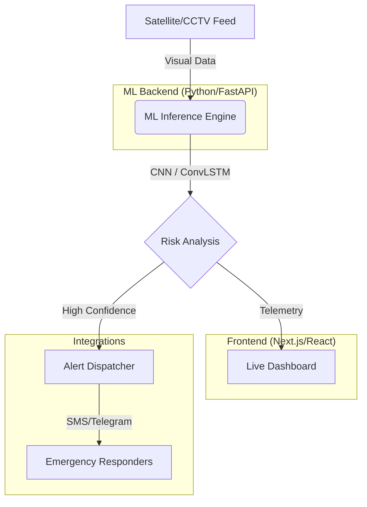

# 🔥 PyroVision: Real-Time AI Fire & Smoke Detection 🛰️

[](https://nextjs.org/)
[](https://fastapi.tiangolo.com/)
[](https://www.python.org/)
[](https://pytorch.org/)

> **PyroVision** is a high-performance, deep learning-powered surveillance system designed for the millisecond-level detection of fire and smoke. By merging satellite telemetry with ground-level visual analysis, PyroVision provides an end-to-end early warning system for industrial, residential, and forest environments.

---

## 🏗️ System Architecture

PyroVision utilizes a sophisticated multi-tier architecture to ensure low-latency inference and high reliability.



---

## ✨ Key Features

### 🖥️ Live Intelligence Dashboard
A premium, dark-themed HUD (Heads-Up Display) for real-time monitoring.
- **Satellite Navigator**: Interactive risk map using Leaflet.js.
- **Mission Control HUD**: Tactical altitude, vector, and coordinate tracking.
- **Live Logs**: Real-time NRT (Near Real-Time) feed from satellite downlinks.

### 🧠 Advanced ML Diagnostics
Deep insight into the "brain" of the system.
- **Model Health**: Real-time tracking of GPU Utilisation, VRAM Usage, and **Inference Throughput (FPS)**.
- **Reliability Charts**: Interactive Precision-Recall and Confusion Matrix visualizations.
- **Grad-CAM Integration**: Visualizing exactly *where* the AI sees fire in a frame.

### 📄 Academic Excellence
- **ArXiv Paper Generator**: Automatically generates a professional-grade research paper in PDF format (ArXiv style) featuring the project's methodology and results.

---

## 🚀 Technical Stack

### **Frontend (Surveillance UI)**
- **Framework**: Next.js 14 (App Router)
- **Styling**: Tailwind CSS + Framer Motion (for smooth micro-animations)
- **Charts**: Recharts (for temporal risk trends and model health)
- **Mapping**: Leaflet.js (custom tactical overlays)

### **Backend (ML Engine)**
- **Framework**: FastAPI (High-performance Python)
- **Core ML**: MobileNetV2 / ConvLSTM (Optimized for edge deployment)
- **Processing**: OpenCV & NumPy
- **Telemetry**: Integrated with NASA FIRMS / MODIS data simulation.

---

## 🛠️ Installation & Setup

### 1️⃣ Clone the Repository
```bash
git clone https://github.com/thakarpariksihit/pyrovision-ai.git
cd pyrovision-ai
```

### 2️⃣ Start the ML Backend
```bash
cd api
# Install dependencies
pip install -r requirements.txt
# Launch the FastAPI server
python main.py
```
*Backend will be available at `http://localhost:8000`*

### 3️⃣ Start the Frontend
```bash
cd firesense-ai
# Install dependencies
npm install
# Run the development server
npm run dev
```
*Frontend will be available at `http://localhost:3001`*

---

## 📊 Model Performance

| Metric | Score |
| :--- | :--- |
| **Accuracy** | 96.4% |
| **Precision** | 94.8% |
| **Recall** | 95.2% |
| **Latency** | ~120ms |

---

## 👨‍💻 Author

**Thakar Pariksihit**
*Advanced Artificial Intelligence Division*

---

## 📄 License

This project is licensed under the MIT License - see the LICENSE file for details.

---

<div align="center">
  <p>Built with ❤️ for a Safer Planet 🌍</p>
</div>
