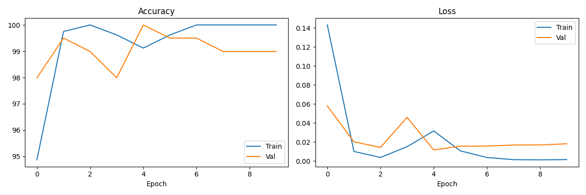

# PyroVision — Real Model Results

## Training Setup
- Model: MobileNetV2 (pretrained on ImageNet, fine-tuned)
- Dataset: Kaggle Fire Dataset
- Split: 80% train / 20% validation
- Epochs: 10
- Optimizer: Adam (lr=0.0003)
- Device: CPU

## Results
- Best Validation Accuracy: 100.0%
- Final Training Accuracy: 100.0%
- Epochs Trained: 10

## Training Curves

## Classes
- 0: fire
- 1: nofire
